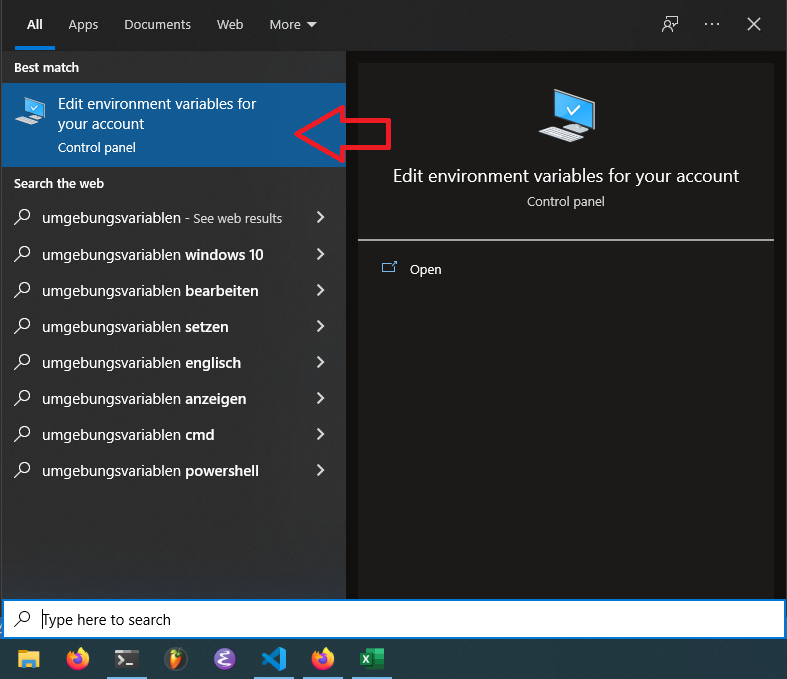
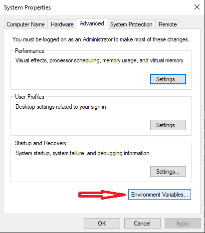
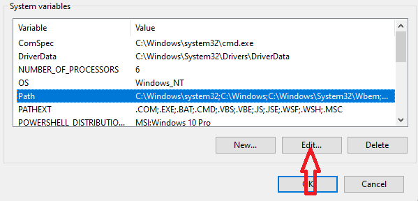
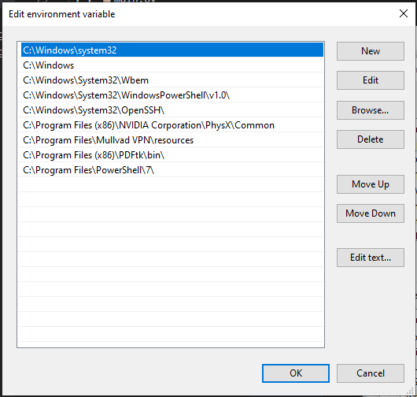

# Cheat Sheet

## Ordnerstrukturen und Dateipfade
### Windows
In Windows existieren mehrere Dateisystemwurzeln welche durch einen Laufwerkbuchstaben mit `':'`-Suffix gekennzeichnet werden.\
Jede logische [Partition](https://de.wikipedia.org/wiki/Partition_(Datentr%C3%A4ger)) stellt eine eigene Wurzel dar.
#### Beispiel:
```
📦C: <== Wurzel 1 
 ┣ 📂Benutzer
 ┣ 📂Program Files
 ┣ 📂Program Files (x86)
 ┣ 📂Windows
    ...
📦D: <== Wurzel 2 (z.B. extra Partition fuer Dokumente)
 ┣ 📂Bilder
 ┣ 📂Dokumente
 ┗ 📂Projekte

📦E: <== Wurzel 3 (z.B. ein USB-Stick)
 ┣ 📂DCIM
 ┣ 📂Backups
    ...
```
### Linux etc.
In [Unixoiden](https://de.wikipedia.org/wiki/Unixoides_System) Betriebssystemen existiert nur eine Dateisystemwurzel, welche durch einen einfachen `/` gekennzeichnet wird.\
[Partitionen](https://de.wikipedia.org/wiki/Partition_(Datentr%C3%A4ger)) sehen hier aus wie ganz normale Ordner und werden meist unter `/mnt` oder `/media` eingebunden ([mount](https://de.wikipedia.org/wiki/Einh%C3%A4ngepunkt)).
#### Beispiel:
```
📦/ <== Wurzel
 ┣ 📂bin
 ┣ 📂etc
 ┣ 📂home <== entspricht C:\Benutzer in Windows
 ┣ 📂mnt
 ┃ ┣ 📂stick 
 ┃ ┗ 📂daten <== entspricht z.B. "D:"
 ┃   ┣ 📂Bilder
 ┃   ┣ 📂Dokumente
 ┃   ┗ 📂Projekte
 ┣ 📂sys
 ┣ 📂usr
 ┗ 📂var
```
### Dateipfade
Man unterscheidet unabhängig vom Betriebssystem zwischen `relativen` und `absoluten` Dateipfaden.
#### Absolute Dateipfade
Ein absoluter Pfad zu einer Datei gibt den Weg an, den man gehen muss um von einer Wurzel zur gewünschten Datei zu gelangen.\
> Windows:\
`C:\Windows\System32\drivers\NVIDIA Corporation\Drs\nvdrsdb.bin`

> Linux:\
>  `/etc/X11/xinit/xinitrc`

Man erkennt, dass Windows und Linux unterschiedliche Trennzeichen verwenden (`/` vs. `\`). In den meisten Fällen sollte man `/` bevorzugen, da `\` in vielen Programmiersprachen als Einleitung einer [Escape-Sequenz](https://de.wikipedia.org/wiki/Escape-Sequenz) verstanden wird.

#### Relative Dateipfade
Ein relativer Pfad bezieht sich immer auf das aktuelle Arbeitsverzeichnis (Working Directory).\
Es gibt hierbei 2 Sonderzeichen:
|Zeichen|Bedeutung|
|-|-|
|.|Aktuelles Verzeichnis|
|..|Wechsel ins übergeordnete Verzeichnis|

Es sei folgende Ordnerstruktur vorgegeben:
```
📦Projekt
 ┣ 📂resources
 ┃ ┣ 📂img
 ┃ ┃ ┗ 📜test2.png
 ┃ ┗ 📂snd
 ┃ ┃ ┗ 📜recording.wav
 ┗ 📂src <== YOU ARE HERE
 ┃ ┣ 📜main.py
 ┃ ┗ 📜test1.png
```
> Um vom aktuellen Verzeichnis `src` die Datei `test.png` aus `img` zu referenzieren, benötigen wir den relativen Pfad `../resources/img/test.png`.
> |Datei|Pfad ausgehend von `src`|
|-|-|
|`test1.png`| `./test1.png`|
|`test2.png`|`../resources/img/test.png`|
|`recording.wav`|`../resources/snd/recording.wav`|
|`main.py`|`./main.py`|

## Das Terminal / Die Kommandozeile / Die Shell
Anstatt über die grafische Benutzeroberflaeche, kann man auch direkt über textbasierte Befehle mit dem Betriebssystem interagieren.
Ermöglicht wird das durch eine `Shell`.
Sie liest die vom Benutzer eingetippten Befehle interpretiert, und führt sie anschließend aus.
Eingetippt werden diese Befehle in einem [Terminal-Emulator](https://de.wikipedia.org/wiki/Terminalemulation).
Windows 10 liefert mindestens 2 Solcher Terminal-Emulatoren: `cmd` und `powershell` 
> ACHTUNG:
> die jeweils im Hintergrund arbeitenden `Shells` unterscheiden sich.\
> Ein Befehl, welcher z.B. in `powershell` erkannt wird, funktioniert nicht zwingend auch in `cmd` !
### Was ist ein "Befehl"?
Befehle sind nichts weiter als Programme wie `Firefox`, `Chrome` oder `Notepad`.
Jedes installierte Programm ist ein "Befehl".
Damit die jeweilige Shell das Programm jedoch findet, muss der Pfad zum Verzeichnis in welchem das Programm sich befindet in einer Liste stehen, welche von vorne nach hinten durchsucht wird.
Diese "Liste" ist eine sog. Umgebungsvariable die als `PATH` bezeichnet wird.
Man kann sie wie folgt einsehen und bearbeiten:











Alternativ kann man sich den Pfad in der `cmd` auch durch den Befehl `path` anzeigen lassen.

## Einige grundlegende Befehle

> Vollständige liste der in `cmd` gültigen [Befehle](https://docs.microsoft.com/de-de/windows-server/administration/windows-commands/windows-commands)

> Einführung in [Powershell](https://docs.microsoft.com/de-de/powershell/scripting/learn/ps101/01-getting-started?view=powershell-7.2) (Achtung: Sehr umfangreich)


|Befehl|Argumente|Beschreibung|Powershell|CMD|
|-|-|-|-|-|
|ls|-|lists content of current directory|YES|NO|
|dir|-|lists content of current directory|YES|YES|
|pwd|-|prints absolute path of current working directory|YES|NO|
|cd| pfad |changes the current directory|YES|YES|
|mkdir| pfad | makes directory |YES|YES|
|rmdir| pfad | removes directory |YES|YES|
|rm| pfad | removes a File (or directory)|YES|NO|
|del| pfad | removes a file| NO | YES|
|cls| - | clears the terminal | YES | YES |
|clear| -| clears the terminal | YES | NO |
|path| - | shows contents of the PATH environment variable| NO | YES |

# Python
